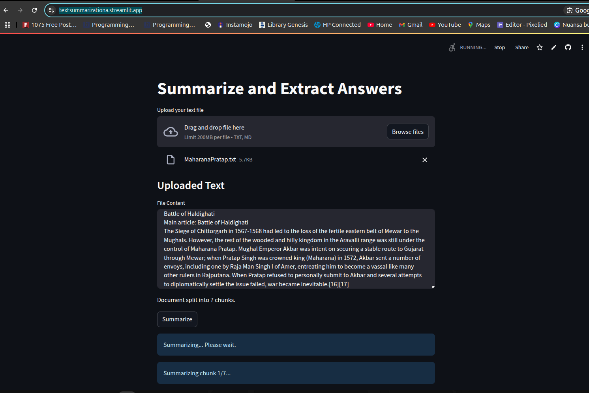

# Text Summarization With bart-large-cnn Model

This project is an implementation of text summarization using the bart-large-cnn model. The project uses the Hugging Face Transformers library to load the pre-trained model and generate summaries for input text. The project includes a simple web interface that allows users to input text and generate summaries using the model.

## Usage

The project is free to use without any cost. You can use it for your personal use or for your projects. You can also modify the code and use it for commercial purposes. You can also contribute to the project by adding new features or fixing bugs.

No API key is required to use this project. You can simply clone the repository and run the project on your local machine.

# Try Out on Streamlit
## [Open Application in Streamlit](https://textsummarizationa.streamlit.app/)

## Installation

To install the project, you need to have Python installed on your machine. You can download Python from the official website. Once you have Python installed, you can clone the repository and install the required dependencies using the following commands:

Requirements File:
```bash
pip install -r requirements.txt
```

## Running the Project

To run the project, you can use the following command:
```bash
streamlit run TextSummarizationAI_v2.py
```

## Images:
